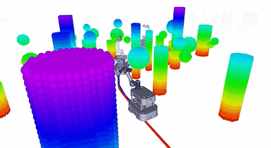
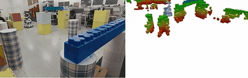

I am Yuqiang Yang, a master student at [South China University of Technology](https://www.scut.edu.cn/new/), supervised by [Prof. Chenguang Yang](https://scholar.google.com/citations?user=e8io0fYAAAAJ&hl=zh-CN&oi=ao). My research interests are to explore and exploit the potentiality of various robots, such as **mobile manipulator, autonomous car and multicopter**, to perform tasks autonomously and efficiently in unstructured environment. 
<!-- The goal of my research is to endow robots with **agile mobility and manoeuvrability** in a 3d cluttered **dynamic** environment. -->
   
Specifically, I have explored and realized the posibility of allowing the mobile manipulators to efficiently pick and place in a **wholebody** manner while avoidance collision smoothly **in cluttered dynamic environment** full of chairs, tables and shelves. Besides, I am working towards the low-cost and accurate state estimation (Visual Inertial Odometry) , mapping (Occupancy Grid Map and Euclidean Signed Distance Field), planning and control (SE3) framework for **quadrotor** in complex environments. For **autonomous car** with non-holonomic constraints, I investigated the **real-time** perception, mapping and collision-free motion planning to follow and serve the target person well. I have sufficient engineering experience on deploying algorithms in various robotic scenarios such as environmental reconstrunction, household service and car racing, etc. 

## Education and Trainning

<i><b>South China University of Technology</b></i>
 Master, Robotics
 Supervisor: Prof. <a href="https://scholar.google.com/citations?user=e8io0fYAAAAJ&hl=zh-CN&oi=ao">Chenguang Yang</a>
  GPA: 3.82/4.0 (ranked first)

<i>Sep. 2022 - Present</i>
 
   

<i><b>South China University of Technology</b></i>
 Bachelor of Engineering, Automation
 School of Automation Science and Engineering
 GPA: 3.94/4.0 (ranked first)

 
<i>Sep. 2018 - Jun. 2022</i>
  

 
 

<i><b> <a href="http://zju-fast.com/fei-gao">FastLab</a> of Zhejiang University</b></i>
 Visiting student
 Wholebody planning and  control for multicopter
 Supervisor: Prof. <a href="http://zju-fast.com/fei-gao">Fei Gao</a>

 
<i>Oct. 2023 - Nov. 2023</i>
  
 
 

## Research Experiences

 <b>RAMPAGE: Towards Whole-body, Real-Time and Agile Motion Planning in Dynamic Cluttered Environments for Mobile Manipulators</b>  [<a href="https://yuqiang-yang.github.io/publications#rampage">Video</a>,  <a href="https://github.com/yuqiang-yang/TIE-Supplementary-video">PDF</a>]
 
<i>2022.10 - 2023.12</i>
  

Accepted to IEEE Transaction on Industrial Electronics

Advisor: Dr. Chen Chen, Dr. <a href="https://scholar.google.com.hk/citations?user=yO5K6xwAAAAJ&hl=th">Zehui Meng</a>

<ul>
<li>
    Developed a novel <b>hierarchical topology-guided</b> searching method to find whole-body kinodynamic trajectories in real time (≈30ms), striking good balance in the success rate and the efficiency.
</li>
<li>
  
 Derived and implemented a whole-body trajectory optimization method which naturally <b>integrates the planning and control module</b> (IPC) in an augmented Lagrangian differential dynamic programming (AL-DDP) form.

</li>
<li>
  
Utilized a <b>real-time constructed ESDF map</b> and a novel sphere decomposition for mobile manipulator to achieve one-shot collision detection against dynamic obstacles in batch</b>.

</li>
<li>
Conducted extensive experiments to demonstrate the effectiveness of our framework in planning and executing whole-body collision-free
trajectories with a high success rate (≈80%) and a excellent tracking accuracy among highly dynamic obstacles.
</li>
</ul>

  

    

      
    

    

      
    

  

  

    

      
    

  

  

<b>Learn to Coordinate: a Whole-Body Learning from Demonstration Framework for Differential Drive Mobile Manipulators</b> 
[<a href="https://yuqiang-yang.github.io/publications#open_door">Video1</a>, <a href="https://yuqiang-yang.github.io/publications#learning">Video2</a>, <a href="https://ieeexplore.ieee.org/abstract/document/10394442">PDF</a>]
 
<i>2022.04 - 2022.09</i>

 
Accepted to 2023 IEEE Conference on Systems, Man, and Cybernetics 

 
Advisor: Prof. Chenguang Yang

<ul>
<li>
  
Proposed a
whole-body learning from demonstration framework through <b>Gaussian Process</b>, which
endows the mobile manipulator’s skill learning process with
features of coordination working and
disturbance rejection, after just <b>a few human demonstrations</b>.

</li>
<li>
  
 Devised an efficient kinesthetic teaching method based on the <b>weighted least-norm (WLN)</b> inverse kinematics solution and an admittance controller, which facilitates human users to guide the mobile manipulator to perform tasks.

</li>
<li>
  
 Implemented a model-based and robust <b>door openning</b> algorithm for mobile manipulator in a coordinated whole-body manner, even under <b>random disturbance</b>.

</li>
</ul>
  

    

      
    

  

## Project Experiences

**Low-cost and effient location, mapping, planning and control for multicopter in embedded system** 
[<a href="https://yuqiang-yang.github.io/talks#planning">Video1</a>, <a href="https://yuqiang-yang.github.io/talks#hover">Video2</a>, <a href="https://yuqiang-yang.github.io/talks#rcesdf">Video3</a>]

Application Innovate Laboratory, Huawei; FastLab, Zhejiang University
 
<i>2023.2 - present</i>

  
Advisor: Dr. Chen Chen; Dr. <a href="https://scholar.google.com.hk/citations?user=yO5K6xwAAAAJ&hl=th">Zehui Meng</a>; Prof. <a href="https://scholar.google.com.hk/citations?user=4RObDv0AAAAJ&hl=zh-CN">Fei Gao</a>

<ul>
<li>
 
 The VIO is improved from <a href="https://github.com/HKUST-Aerial-Robotics/VINS-Fusion">Vins-Fusion</a> to achieve best performance in a low-performance chip. The front-end feature extraction part is changed to a <b>learning-based feature </b><a href="https://github.com/facebookresearch/silk">Silk</a>, boosting the computation efficiency though an <b>nerual processing unit (NPU)</b>. The back-end combines the filter-based and optimization-based methods to strike a good balance between the computation efficency and the location precision. 

</li>
<li>
  
 We design and implement a low-cost efficient occupancy grid map (OGM) updating algorithm with the features of <b>incremental inflation</b> and <b>spatial-temporal sliding windows</b>. This enables a fast occupancy infomation update in large environment.

</li>

<li>
  
 A <b>robot-centric ESDF</b> (RC-ESDF) is utilized to represent the collision cost in the back-end optimization of our model prediected contour control (MPCC). This <b>lazy evaluation strategy</b> saves many times and calculations, allowing to plan and excute agressive trajectory in unknown environment.

</li>

</ul>

**SE3 planning and control for multicopter to cross narrow gap** 
[<a href="https://yuqiang-yang.github.io/talks#se3">Video</a>]

 FastLab, Zhejiang University
 
<i>2023.2 - present</i>

  
Advisor:  Prof. <a href="https://scholar.google.com.hk/citations?user=4RObDv0AAAAJ&hl=zh-CN">Fei Gao</a>

<ul>
<li>
 
 We also construct a <b>safe flight corridor</b> (SFC) consisting of many convex polytopes. Then <a href="https://github.com/ZJU-FAST-Lab/GCOPTER">MINCO</a> trajectory will be optimized and executed with a finely tuned controller considering the <b>full dynamics</b> to make the multicoter cross a narrow gap. 

</li>
<li>
  
 We design and implement a low-cost efficient occupancy grid map (OGM) updating algorithm with the features of <b>incremental inflation</b> and <b>spatial-temporal sliding windows</b>. This enables a fast occupancy infomation update in large environment.

</li>

</ul>

**Pedestrian following and collision avoidance with spatial-temporal optimization for differential car** [<a href="https://yuqiang-yang.github.io/teaching#follow">Video</a>]

Application Innovate Laboratory, Huawei. FastLab, Zhejiang University
 
<i>2023.2 - 2023.11</i>

  
Advisor: Dr. Chen Chen. Dr. Zehui Meng. Prof. Fei Gao

<ul>
<li>
  
 A multi-level hybrid A* algorithm is used to find intial kinodynamic trajecory to the future position (predicted by EKF) in a certain horizon. It considers the <b>object occlusion, uncertainty and collision</b> simultaneously.

</li>
<li>
  
 We filter the object pointcloud of OUSTER lidar based on the bounding box generated by the visual perception. After then, the regristerd pointcloud by Fast-Lio2 will be considered as obstacles.

</li>
<li>
  
 The initial trajectory parameterized by MINCO is optimized <b>spatially and temporally</b>. A low-level MPC considering the kinematics and communication delay is implemented to accurately track the planning trajecoty.

</li>
</ul>

**Self-balanced smart car with wireless charging capability** [<a href="https://yuqiang-yang.github.io/teaching#balance">Video</a>]

School of Automation Science and Engineering, SCUT
 
<i>2020.01 - 2020.08</i>

  
Advisor: Dr. An Chen

<ul>
<li>
  
Design and implement the adaptive wireless-charging algorithm to quickly charge the supercapacitors mounted on the car. A series control system from the charging power loop to the charging current loop is designed to stabilize the charging power at 30W.

</li>
<li>
  
 Control the position and orientation of the two-wheeled car to complete a complex race track with different elements such as circles and slopes. The perception information mainly comes from the onboard IMU and electromagnetic sensors.

</li>
<li>
  
 We finished the race in fifth national ranking with a time of 23.8s and won the <b>first prize</b>.

</li>
</ul>

**Graceful wholebody pick-and-place for mobile manipulator** [<a href="https://yuqiang-yang.github.io/talks#pick_and_place">Video</a>]

Application Innovate Laboratory, Huawei
 
<i>2022.10 - 2022.11</i>

  
Advisor: Dr. Chen Chen

<ul>
<li>
  
Train <a href="https://github.com/dougsm/ggcnn">GGCNN</a>  for the perception of the objects' pose and the grasp quality. The inputs of GGCNN are pointclouds while the outputs are the grasp quality, width and orientation.

</li>
<li>
  
 Jointly consider the manipulability, energy, manipulator orientation and path tracking in the QP solvers. The <b>dynamic-weighted QP</b> is implemented based on the tracking error to achieve graceful picking-and-placing.

</li>
</ul>

## Honor & Awards

<ul>
<li> 
National Scholarship
 
<i>2021-10</i>
</li>

<li> 
 Scholarship of <a href="https://www.gac.com.cn/cn/" title="GuangQi">Guangzhou Automobile Group Co., Ltd</a>
 
<i>2020-10</i>
</li>
<li> 
National Scholarship
 
<i>2019-10</i>
</li>
<li> 
The first prize of the <a href="https://www.caa.org.cn/Content/260.html" title="zhinengche">National University Students Intelligent Car Race</a> 
 
<i>2020-08</i>
</li>
<li> 
Meritorious Winner of  <a href="https://www.comap.com/contests/mcm-icm" title="zhinengche">Interdisciplinary Contest In Modeling (ICM)</a> 
 
<i>2021-03</i>
 </li>
</ul>

## Internship
**Huawei Technologies Co.Ltd**

<i>Intern, Application Innovation Laboratorys</i>
 

<i>June. 2022 - now</i>
 

Planning and Control for various robots

 Supervisor: Dr. Chen Chen, Dr. Zehui Meng

## Skills

**Programming:**

Python, MATLAB, C/C++, PyTorch, Pybullet, Airsim, Embedded System
  

**Robotics:**

Wholebody control, Peception and mapping, Convex Optimization, Admittance/Impedance Control, Gravity Compensation, teleoperation

**Hardware Experience:**

Multicopter, <a href="https://en.directdrive.com/">Diablo</a>, Franka, UR, Mobile Manipulator, Robotiq 2F85, Vicon, Touch X, ATI sensors, STM32
