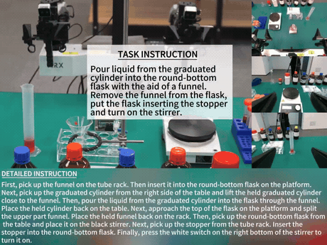
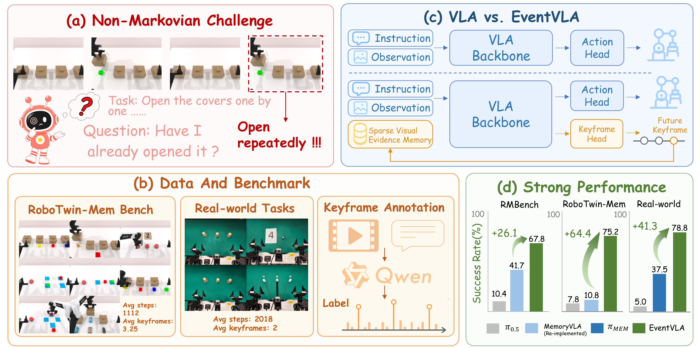
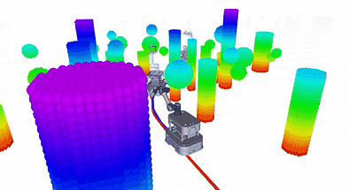
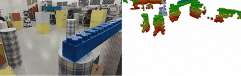
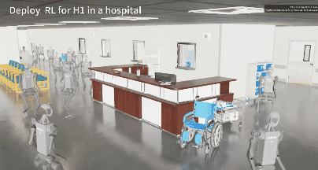
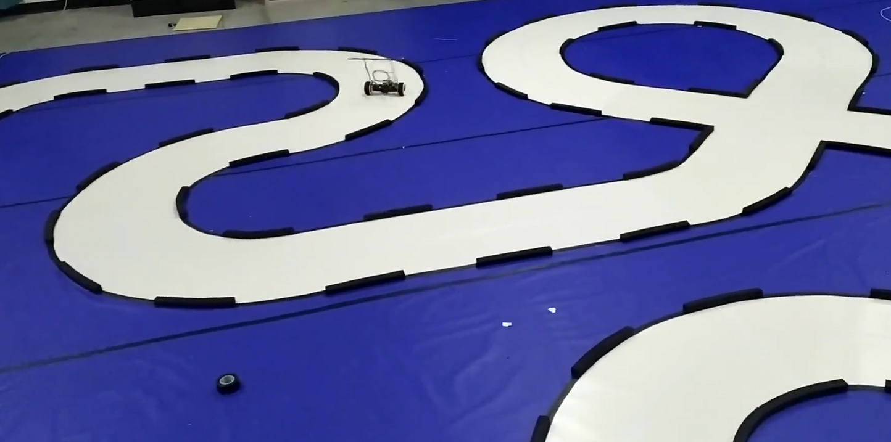

I am Yuqiang Yang, a Research and Development Engineer at the [Embodied AI Center](https://internrobotics.shlab.org.cn/), [Shanghai AI Laboratory](https://www.shlab.org.cn/), working with [Dr. Tai Wang](https://tai-wang.github.io/) and [Dr. Jiangmiao Pang](https://oceanpang.github.io/). I have **full-stack experience** in robotic foundation models, covering data processing, training infrastructure, high-speed model inference, and simulation/real-world evaluation. My current research interest is to build **robust and generalizable robotic systems** through systematic system design and holistic optimization, enabling embodied AGI to better serve real-world human needs.

My research experience spans three closely connected areas: **robot manipulation**, **navigation**, and **mobile manipulation**. In robot manipulation, I work on pre-training and adapting robotic foundation models with heterogeneous robot and multimodal data (e.g. COCO series, LLaVA series) and large-scale robot datasets (e.g. OXE, AgiBot World), and evaluate them on mainstream simulation benchmark (e.g Robtwin, Simpler, Calvin) and real-world environment. In navigation, I explore **dual-system navigation frameworks**, where a VLM-based **System-2** model performs high-level reasoning and decision-making, while a diffusion-based **System-1** model enables smooth and efficient obstacle avoidance across different embodiments, such as **Unitree G1, Go2, TurtleBot, and Galaxea**. In mobile manipulation, I investigate **whole-body planning and control** for mobile manipulators, enabling efficient pick-and-place tasks while avoiding collisions in cluttered and dynamic environments with chairs, tables, and shelves.

Our team is dedicated to building **Embodied AGI systems** and empowering both academia and industry through open-source initiatives. We have contributed many research projects and codebases on [GitHub](https://github.com/InternRobotics). If you are interested in joining us or collaborating with us, feel free to contact us.
## Education and Training

<i><b>South China University of Technology</b></i>
 Master, Robotics
 Supervisor: Prof. <a href="https://scholar.google.com/citations?user=e8io0fYAAAAJ&hl=zh-CN&oi=ao">Chenguang Yang</a>
  GPA: 3.82/4.0 (ranked first)

<i>Sep. 2022 - Jun. 2025</i>
 
   
 

<i><b>South China University of Technology</b></i>
 Bachelor of Engineering, Automation
 School of Automation Science and Engineering
 GPA: 3.94/4.0 (ranked first)

 
<i>Sep. 2018 - Jun. 2022</i>
  

 
 
 

<i><b> <a href="http://zju-fast.com/fei-gao">FastLab</a> of Zhejiang University</b></i>
 Visiting student
 Wholebody planning and  control for multicopter
 Supervisor: Prof. <a href="http://zju-fast.com/fei-gao">Fei Gao</a>

 
<i>Oct. 2023 - Nov. 2023</i>
  
 
 

## Research Experiences

  <!-- 左侧：30%宽度（固定比例，不折行），论文图片 -->
  

    
  

  <!-- 右侧：70%宽度（固定比例，不折行），标题+链接+备注 -->
  

    <h3 style="margin-top: 0; font-size: 18px; line-height: 1.5;">Cortex: A Bidirectionally Aligned Embodied Agent Framework for Long-horizon Manipulation</h3>
    
2026 arXiv

    
[<a href="https://steinate.github.io/cortex.github.io/">Project Page</a>]&nbsp;[<a href="https://steinate.github.io/cortex.github.io/#real-rollouts">Video</a>]&nbsp;[<a href="https://steinate.github.io/cortex.github.io/static/slides/cortex-technical-talk.pptx">Slides</a>]

    
We present Cortex, a bidirectionally aligned embodied agent framework that connects a high-level VLM cognitive orchestrator with a low-level VLA executor through executable subtasks, compact memory, and online progress verification. Cortex standardizes long-horizon manipulation into grounded skill primitives and keeps planning, memory, and physical execution synchronized across simulation and real-world chemical workflows.

  

  <!-- 左侧：30%宽度（固定比例，不折行），论文图片 -->
  

    
  

  <!-- 右侧：70%宽度（固定比例，不折行），标题+链接+备注 -->
  

    <h3 style="margin-top: 0; font-size: 18px; line-height: 1.5;">EventVLA: Event-Driven Visual Evidence Memory for Long-Horizon Vision-Language-Action Policies</h3>
    
2026 arXiv

    
[<a href="https://ganlin-yang.github.io/EventVLA.github.io/">Project Page</a>]&nbsp;[<a href="https://arxiv.org/abs/2606.20092">Paper</a>]&nbsp;[<a href="https://github.com/InternRobotics/EventVLA">Code</a>]&nbsp;[<a href="https://huggingface.co/datasets/ganlinyang/RoboTwin-MeM">Data</a>]&nbsp;[<a href="https://huggingface.co/ganlinyang/EventVLA">Model</a>]

    
We introduce EventVLA, an end-to-end VLA framework for long-horizon manipulation with sparse visual evidence memory. Its Keyframe Evidence Memory module predicts future keyframe utility from latent embeddings, stores task-critical visual events before they become occluded, and reuses them during action prediction, together with RoboTwin-MeM for evaluating non-Markovian manipulation tasks.

  

  <!-- 左侧：30%宽度（固定比例，不折行），论文图片 -->
  

    
  

  <!-- 右侧：70%宽度（固定比例，不折行），标题+链接+备注 -->
  

    <h3 style="margin-top: 0; font-size: 18px; line-height: 1.5;">InternVLA-A1: Unifying Understanding, Generation and Action for Robotic Manipulation</h3>
    
2026 Technical report

    
[<a href="https://internrobotics.github.io/internvla-a1.github.io/">Project Page</a>]&nbsp;[<a href="https://arxiv.org/abs/2601.02456">Paper</a>]&nbsp;[<a href="https://github.com/InternRobotics/InternVLA-A1">Code</a>]&nbsp;[<a href="https://huggingface.co/datasets/InternRobotics/InternData-A1">Data</a>]&nbsp;[<a href="https://huggingface.co/InternRobotics/InternVLA-A1-3B">Model</a>]

    
We present InternVLA-A1, a unified VLA model that coordinates scene understanding, visual foresight generation, and action execution with a Mixture-of-Transformers architecture. Trained on heterogeneous robot, simulation, and human-video data, InternVLA-A1 brings world-model-style dynamics prediction into robotic manipulation and shows strong performance on both static and highly dynamic tasks.

  

  <!-- 左侧：30%宽度（固定比例，不折行），论文图片 -->
  

    
  

  <!-- 右侧：70%宽度（固定比例，不折行），标题+链接+备注 -->
  

    <h3 style="margin-top: 0; font-size: 18px; line-height: 1.5;">LatentPilot: Scene-Aware Vision-and-Language Navigation by Dreaming Ahead with Latent Visual Reasoning</h3>
    
2026 ECCV

    
[<a href="https://abdd.top/latentpilot/">Project Page</a>]&nbsp;[<a href="https://arxiv.org/abs/2603.29165">Paper</a>]&nbsp;[<a href="https://github.com/oceanhao/latentpilot">Code</a>]

    
We propose LatentPilot, a future-aware VLN paradigm that learns action-conditioned visual dynamics from future observations during training while requiring only current observations at inference. Its recurrent latent visual tokens allow the agent to dream ahead, reason over likely scene changes, and improve navigation decisions in simulation and real-world tests.

  

  <!-- 左侧：30%宽度（固定比例，不折行），论文图片 -->
  

    
  

  <!-- 右侧：70%宽度（固定比例，不折行），标题+链接+备注 -->
  

    <h3 style="margin-top: 0; font-size: 18px; line-height: 1.5;">OVExp: Open Vocabulary Exploration for Object-Oriented Navigation</h3>
    
2026 ICRA

    
[<a href="https://arxiv.org/abs/2407.09016">Paper</a>]&nbsp;[<a href="https://arxiv.org/html/2407.09016">HTML</a>]

    
We introduce OVExp, a learning-based framework for open-vocabulary object-oriented exploration. OVExp builds VLM-aware top-down scene representations, aligns text or image goals in the same feature space, and predicts goal-conditioned target locations with a lightweight decoder, enabling efficient generalization to unseen objects, image goals, and novel scenes.

  

  <!-- 左侧：30%宽度（固定比例，不折行），论文图片 -->
  

    
  

  <!-- 右侧：70%宽度（固定比例，不折行），标题+链接+备注 -->
  

    <h3 style="margin-top: 0; font-size: 18px; line-height: 1.5;">Ground Slow, Move Fast: A Dual-System Foundation Model for Generalizable Vision-Language Navigation
</h3>
    
2026 ICLR

    
[<a href="https://dualvln.github.io">Project Page</a>]&nbsp;[<a href="https://arxiv.org/abs/2512.08186">Paper</a>]&nbsp;[<a href="https://github.com/InternRobotics/InternNav">Code</a>]&nbsp;[<a href="https://zhuanlan.zhihu.com/p/1983313347735754252">Zhihu</a>]

    
We propose DualVLN, a dual-system foundation model for Vision-Language Navigation, which includes: (i) System 2: a large foundation VLM, performs slow but robust reasoning and produces explicit pixel goals. (ii) System 1: a lightweight diffusion policy, generates smooth and safe trajectories in real time.

  

  <!-- 左侧：30%宽度（固定比例，不折行），论文图片 -->
  

    
  

  <!-- 右侧：70%宽度（固定比例，不折行），标题+链接+备注 -->
  

    <h3 style="margin-top: 0; font-size: 18px; line-height: 1.5;">LoGoPlanner: Localization Grounded Navigation Policy with Metric-aware Visual Geometry
</h3>
    
2026 ICRA

    
[<a href="https://steinate.github.io/logoplanner.github.io/">Project Page</a>]&nbsp;[<a href="https://arxiv.org/abs/2512.19629/">Paper</a>]&nbsp;[<a href="https://github.com/InternRobotics/NavDP/tree/master/baselines/logoplanner">Code</a>]&nbsp;[<a href="https://www.xiaohongshu.com/explore/694a6a98000000001e001de5?secondshare=weixin&share_from_user_hidden=true&appuid=&apptime=1766490583&share_id=79b6fd07709a4a9bac49efa1b71e622b&xsec_source=h5_share&xsec_token=CBC8ercf50EWYtlPvqEuNgMb3VOGluK-uIjnadx7oMfP0=&wechatWid=b5c0472497dc4df32c2c6f3c1f9047a3&wechatOrigin=menu">RedNote</a>]

    
We introduce LoGoPlanner, a localization-grounded, end-to-end navigation framework: (i) finetuning a long-horizon visual-geometry backbone to ground predictions with absolute metric scale, thereby providing implicit state estimation for accurate localization; (ii) reconstructing surrounding scene geometry from historical observations to supply dense, fine-grained environmental awareness for reliable obstacle avoidance; and (iii) conditioning the policy on implicit geometry bootstrapped by the aforementioned auxiliary tasks, thereby reducing error propagation.

  

  <!-- 左侧：30%宽度（固定比例，不折行），论文图片 -->
  

    
  

  <!-- 右侧：70%宽度（固定比例，不折行），标题+链接+备注 -->
  

    <h3 style="margin-top: 0; font-size: 18px; line-height: 1.5;">InternVLA-N1: An Open Dual-System Vision-Language Navigation Foundation Model with Learned Latent Plans</h3>
    
2025 Technical report

    
[<a href="https://internrobotics.github.io/internvla-n1.github.io/">Project Page</a>]&nbsp;[<a href="https://internrobotics.github.io/internvla-n1.github.io/static/pdfs/InternVLA_N1.pdf">Paper</a>]&nbsp;[<a href="https://github.com/InternRobotics/InternNav">Code</a>]&nbsp;[<a href="https://zhuanlan.zhihu.com/p/1951006103295988182">Zhihu</a>]

    
We introduce InternVLA-N1 the first open dual-system vision-language navigation foundation model. Unlike previous navigation foundation models that can only take short-term actions from a limited discrete space, InternVLA-N1 decouples the task as pixel-goal planning with System 2 and agile execution with System 1.

  

  <!-- 左侧：30%宽度（固定比例，不折行），论文图片 -->
  

    
  

  <!-- 右侧：70%宽度（固定比例，不折行），标题+链接+备注 -->
  

    <h3 style="margin-top: 0; font-size: 18px; line-height: 1.5;">StreamVLN: Streaming Vision-and-Language Navigation via SlowFast Context Modeling</h3>
    
2026 ICRA

    
[<a href="https://streamvln.github.io/">Project Page</a>]&nbsp;[<a href="https://arxiv.org/abs/2507.05240">Paper</a>]&nbsp;[<a href="https://github.com/OpenRobotLab/StreamVLN">Code</a>]&nbsp;[<a href="https://zhuanlan.zhihu.com/p/1914387005099451505">Zhihu</a>]

    
We propose StreamVLN, a streaming VLN framework that employs a hybrid slow-fast context modeling strategy to support multi-modal reasoning over interleaved vision, language and action inputs. StreamVLN can understand complex human instructions and finish VLN task in various indoor/outdoor scenarios. 

  

  <!-- 左侧：30%宽度（固定比例，不折行），论文图片 -->
  

    
  

  <!-- 右侧：70%宽度（固定比例，不折行），标题+链接+备注 -->
  

    <h3 style="margin-top: 0; font-size: 18px; line-height: 1.5;">NavDP: Learning Sim-to-Real Navigation Diffusion Policy with Privileged Information Guidance</h3>
    
2026 ICRA

    
[<a href="https://wzcai99.github.io/navigation-diffusion-policy.github.io/">Project Page</a>]&nbsp;[<a href="https://arxiv.org/abs/2505.08712">Paper</a>]&nbsp;[<a href="https://github.com/wzcai99/NavDP">Code</a>]&nbsp;[<a href="https://zhuanlan.zhihu.com/p/1914387005099451505">Zhihu</a>]

    
We propose NavDP, an end-to-end framework trained solely in simulation that combines diffusion-based trajectory generation and a critic function for trajectory selection (conditioned on local observation tokens from a shared policy transformer); it can zero-shot transfer to different robot embodiments in diverse real-world environments.
 

  

  <!-- 左侧：30%宽度（固定比例，不折行），2个小图在上、1个长图在下 -->
  

    <!-- 上方：2个小图横向排列 -->
    

      
      
    

    <!-- 下方：1个长图全屏宽度 -->
    
  

  <!-- 右侧：70%宽度（固定比例，不折行），标题+缩小字号的辅助信息+润色后的总结 -->
  

    <h3 style="margin-top: 0; font-size: 18px; line-height: 1.5;">RAMPAGE: Towards Whole-body, Real-Time and Agile Motion Planning in Dynamic Cluttered Environments for Mobile Manipulators</h3>
    
[<a href="https://yuqiang-yang.github.io/publications#rampage">Video</a>] [<a href="https://github.com/yuqiang-yang/TIE-Supplementary-video">PDF</a>]

    
2024 IEEE Transaction on Industrial Electronics

    
We proposed a hierarchical topology-guided search and AL-DDP-based optimization to solve whole-body kinodynamic planning in dynamic environments, and achieved real-time planning (≈30ms) and ≈80% success rate with accurate collision detection via ESDF map and sphere decomposition.

  

  <!-- 左侧：30%宽度（固定比例，不折行），1个图 -->
  

    
  

  <!-- 右侧：70%宽度（固定比例，不折行），标题+缩小字号的辅助信息+润色后的总结 -->
  

    <h3 style="margin-top: 0; font-size: 18px; line-height: 1.5;">Learn to Coordinate: a Whole-Body Learning from Demonstration Framework for Differential Drive Mobile Manipulators</h3>
    
[<a href="https://yuqiang-yang.github.io/publications#open_door">Video1</a>, <a href="https://yuqiang-yang.github.io/publications#learning">Video2</a>] [<a href="https://ieeexplore.ieee.org/abstract/document/10394442">PDF</a>]

    
2023 IEEE Conference on Systems, Man, and Cybernetics

    
We developed a Gaussian Process-based learning framework with WLN inverse kinematics for few-shot whole-body skill learning, which enabled coordinated door opening with disturbance rejection and simplified human guidance via admittance control.

  

# Project Experiences

  <!-- 左侧：30%宽度（固定比例，不折行），4个图（2x2排列） -->
  

    

      
      
      
      
    

  

  <!-- 右侧：70%宽度（固定比例，不折行），标题+缩小字号的辅助信息+润色后的总结 -->
  

    <h3 style="margin-top: 0; font-size: 18px; line-height: 1.5;">Locomotion in complex terrain through reinforcement learning in Isaac lab</h3>
    
[<a href="https://yuqiang-yang.github.io/cv#rl">Video</a>]

    
We used PPO algorithm with a fine-tuned reward function to train Unitree H1’s locomotion via curriculum learning, and realized robust Sim-to-Sim transfer of RL policies to diverse photo-realistic environments in Nvidia Isaac Sim.

  

  <!-- 左侧：30%宽度（固定比例，不折行），占位图 -->
  

      
  

  <!-- 右侧：70%宽度（固定比例，不折行），标题+缩小字号的辅助信息+润色后的总结 -->
  

    <h3 style="margin-top: 0; font-size: 18px; line-height: 1.5;">Risk-aware contingency motion planning under uncertainties for Automated Valet Parking(AVP)</h3>
    
DJI Automotive

    
We proposed Voronoi-based safe corridors and SplineGrid optimization for lateral bypass plus iLQR for risk-aware longitudinal speed, and handled prediction multimodality via tree-branch iLQR to ensure safe trajectory under perception/prediction uncertainties.

  

  <!-- 左侧：30%宽度（固定比例，不折行），1个图 -->
  

    
  

  <!-- 右侧：70%宽度（固定比例，不折行），标题+缩小字号的辅助信息+润色后的总结 -->
  

    <h3 style="margin-top: 0; font-size: 18px; line-height: 1.5;">Low-cost and efficient location, mapping, planning and control for multicopter in embedded system</h3>
    
[<a href="https://yuqiang-yang.github.io/talks#planning">Video1</a>, <a href="https://yuqiang-yang.github.io/talks#hover">Video2</a>, <a href="https://yuqiang-yang.github.io/talks#rcesdf">Video3</a>]

    
Application Innovate Laboratory, Huawei; FastLab, Zhejiang University | <i>2023.2 - 2024.3</i>

    
We enhanced VINS-Fusion with learning-based features and QR optimization for better accuracy/robustness on low-performance chips, and implemented fast OGM updating (incremental inflation) and robot-centric ESDF for efficient MPCC-based collision-aware control.

  

  <!-- 左侧：30%宽度（固定比例，不折行），1个图 -->
  

    
  

  <!-- 右侧：70%宽度（固定比例，不折行），标题+缩小字号的辅助信息+润色后的总结 -->
  

    <h3 style="margin-top: 0; font-size: 18px; line-height: 1.5;">SE3 planning and control for multicopter to cross narrow gap</h3>
    
[<a href="https://yuqiang-yang.github.io/talks#se3">Video</a>]

    
FastLab, Zhejiang University | <i>2023.10 - 2023.12</i>

    
We built safe flight corridors (SFC) and used MINCO for spatial-temporal trajectory optimization via L-BFGS, and achieved accurate narrow gap crossing by calibrating thrust mapping and tuning controllers for large-attitude tracking.

  

  <!-- 左侧：30%宽度（固定比例，不折行），1个图 -->
  

    
  

  <!-- 右侧：70%宽度（固定比例，不折行），标题+缩小字号的辅助信息+润色后的总结 -->
  

    <h3 style="margin-top: 0; font-size: 18px; line-height: 1.5;">Pedestrian following and collision avoidance with spatial-temporal optimization for differential car</h3>
    
[<a href="https://yuqiang-yang.github.io/teaching#follow">Video</a>]

    
Application Innovate Laboratory, Huawei; FastLab, Zhejiang University | <i>2023.2 - 2023.11</i>

    
We developed multi-level hybrid A* for EKF-predicted pedestrian following plus MINCO optimization for smooth trajectories, and ensured collision avoidance via lidar filtering and MPC control to handle kinematic constraints and communication delay.

  

  <!-- 左侧：30%宽度（固定比例，不折行），1个图 -->
  

    
  

  <!-- 右侧：70%宽度（固定比例，不折行），标题+缩小字号的辅助信息+润色后的总结 -->
  

    <h3 style="margin-top: 0; font-size: 18px; line-height: 1.5;">Self-balanced racing car with wireless charging capability</h3>
    
[<a href="https://yuqiang-yang.github.io/teaching#balance">Video</a>]

    
School of Automation Science and Engineering, SCUT | <i>2020.01 - 2020.08</i>

    
We designed adaptive PD wireless charging (≈30W) for super-capacitors and tuned cascade controllers for stable track navigation, which helped win 5th national place with a 23.8s race time and successful passage through circles, slopes, and crossroads.

  

  <!-- 左侧：30%宽度（固定比例，不折行），1个图 -->
  

    
  

  <!-- 右侧：70%宽度（固定比例，不折行），标题+缩小字号的辅助信息+润色后的总结 -->
  

    <h3 style="margin-top: 0; font-size: 18px; line-height: 1.5;">Wholebody pick-and-place for mobile manipulator</h3>
    
[<a href="https://yuqiang-yang.github.io/talks#pick_and_place">Video</a>]

    
Application Innovate Laboratory, Huawei | <i>2022.10 - 2022.11</i>

    
We trained GGCNN for 6-D object perception and used OSQP to solve dynamic-weighted QP for whole-body coordination, which enabled smooth pick-and-place by balancing manipulability, energy, and trajectory tracking performance.

  

## Honor & Awards

<ul>
<li> 
National Scholarship
 
<i>2024-10</i>
</li>

<li> 
National Scholarship
 
<i>2021-10</i>
</li>

<li> 
 Scholarship of <a href="https://www.gac.com.cn/cn/" title="GuangQi">Guangzhou Automobile Group Co., Ltd</a>
 
<i>2020-10</i>
</li>
<li> 
National Scholarship
 
<i>2019-10</i>
</li>
<li> 
The first prize of the <a href="https://www.caa.org.cn/Content/260.html" title="zhinengche">National University Students Intelligent Car Race</a> 
 
<i>2020-08</i>
</li>
<li> 
Meritorious Winner of  <a href="https://www.comap.com/contests/mcm-icm" title="zhinengche">Interdisciplinary Contest In Modeling (ICM)</a> 
 
<i>2021-03</i>
 </li>
</ul>

## Internship

<i><b> DJI Automotive</b></i>
 Intern, PnC
 Decision and motion planning for autonomous vehicles
 Supervisor: Dr. Yifan Tang, Dr. Zhepei Wang

 
<i>Apr. 2024 - Nov. 2024</i>
  
 
 
 

<i><b> Huawei Technologies Co.Ltd</b></i>
 Intern, Application Innovation Laboratorys
 Planning and Control for various robots
 Supervisor: Dr. Chen Chen, Dr. Zehui Meng

 
<i>June. 2022 - Apr. 2024</i>
  
 
 
 

## Skills

**Programming:**

Python, MATLAB, C/C++, PyTorch, Pybullet, Airsim, Embedded System, Distributed Training, High-speed Model Inference

**Robotics:**

Wholebody Control, Perception and Mapping, Motion Planning, Convex Optimization, Trajectory Optimization, Admittance/Impedance Control, Gravity Compensation, Teleoperation

**Embodied AI:**

Data Preparation, Model Training and Evaluation, Sim2Real Transfer, Embodied Foundation Models, Vision-Language-Action Models, Multimodal Data Processing, Robot Benchmarking and Deployment

**System Integration:**

Robot System Design, Training Infrastructure, Simulation Evaluation, Real-world Evaluation, Model Deployment, Cross-embodiment Generalization

**Robot Hardware Platforms:**

Unitree G1, Unitree Go2, Turtlebot4, Galaxea R1, Ark X5, Lift, AgileX, RealMan, AgiBot G2, Multicopter, <a href="https://en.directdrive.com/">Diablo</a>, Franka, UR, Mobile Manipulator, Robotiq 2F85, Vicon, Touch X, ATI sensors, STM32

