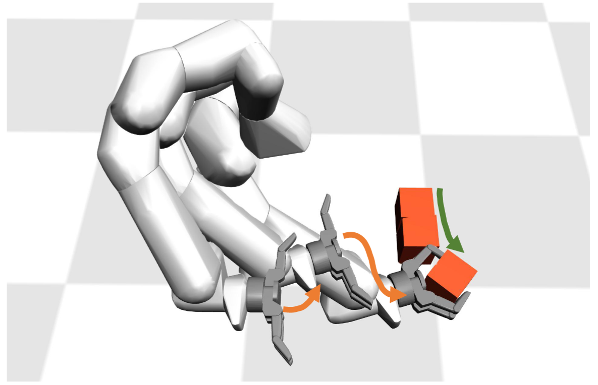
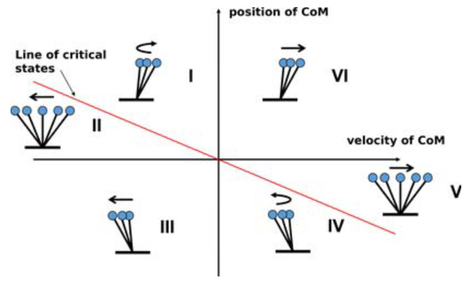
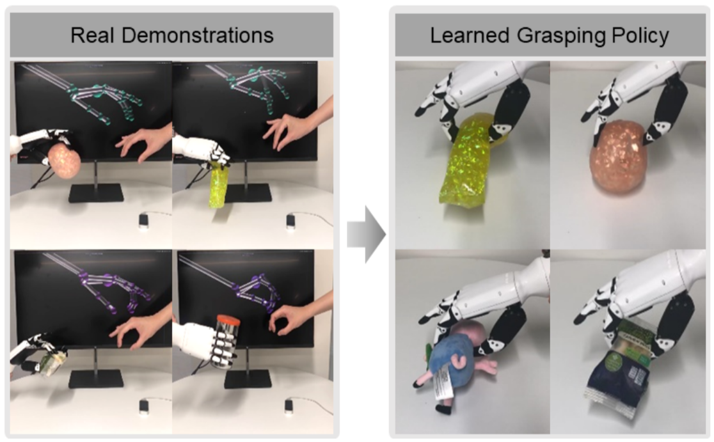
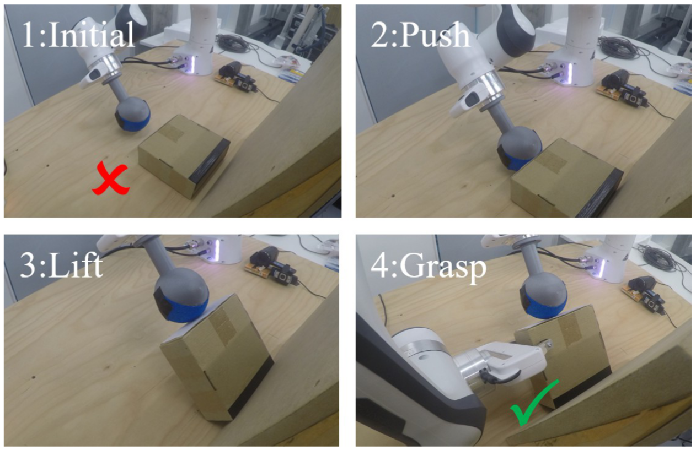

<link rel="stylesheet" href="https://cdn.staticfile.org/font-awesome/4.7.0/css/font-awesome.css">

You can also find my articles on <u><a href="https://scholar.google.co.uk/citations?user=YH8aMHUAAAAJ&hl=en">my Google Scholar profile</a>.</u>

<h2>Learning Motor Skills of Reactive Reaching and Grasping of Objects</h2>

<i><strong> IEEE International Conference on Robotics and Biomimetics (ROBIO), 2021 </strong></i><a href="https://ieeexplore.ieee.org/abstract/document/9739420"><i class="fa fa-file-pdf-o" aria-hidden="true" style="font-size:24px"></i></a>

<i><strong>Wenbin Hu</strong></i>, Chuanyu Yang, Kai Yuan, Zhibin Li
 
<table style="width:100%;border:0px;border-spacing:0px;border-collapse:separate;margin-right:auto;margin-left:auto;margin-top:0px">
  <tr>
    <td style="border:0px;padding:0.1%;width:40%;vertical-align:middle;min-width:120px">
    
    </td>
    <td style="border:0px;padding:2.5%;width:70%;vertical-align:middle">
     This work proposed a deep reinforcement learning based scheme to train feedback control policies which can coordinate reaching and grasping actions in presence of uncertainties. We formulated geometric metrics and task-orientated quantities to design the reward, which enabled efficient exploration of grasping policies. Further, to improve the success rate, we deployed key initial states of difficult hand-finger poses to train policies to overcome potential failures due to challenging configurations. Moreover, the policy generated successful failure recoveries within a short time in difficult configurations and was robust with synthetic noises in the state feedback which were unseen during training.
    </td>
  </tr>
</table>

<h2>Comparison Study of Nonlinear Optimization of Step Durations and Foot Placement for Dynamic Walking</h2>

<i><strong> IEEE International Conference on Robotics and Automation (ICRA), 2018 </strong></i><a href="https://ieeexplore.ieee.org/abstract/document/8461101"><i class="fa fa-file-pdf-o" aria-hidden="true" style="font-size:24px"></i></a>

<i><strong>Wenbin Hu</strong></i>, Iordanis Chatzinikolaidis, Kai Yuan, Zhibin Li
 
<table style="width:100%;border:0px;border-spacing:0px;border-collapse:separate;margin-right:auto;margin-left:auto;margin-top:0px">
  <tr>
    <td style="border:0px;padding:0.1%;width:40%;vertical-align:middle;min-width:120px">
    
    </td>
    <td style="border:0px;padding:2.5%;width:70%;vertical-align:middle">
     This paper studies bipedal locomotion as a nonlinear optimization problem by simultaneously optimizing the remaining step duration, the next step duration and the foot location to achieve robustness. The linear inverted pendulum as the motion model captures the center of mass dynamics. We first formulate a holistic approach to search for optimality in the three-dimensional parametric space and use these results as baseline. To further improve computational efficiency, our study investigates a sequential approach with two stages of customized optimization. The comparison study shows that these two approaches find mostly the same optimal solutions, but the latter requires considerably less computational time, which suggests that the proposed sequential approach is well suited for real-time implementation with a minor trade-off in optimality.
    </td>
  </tr>
</table>

<h2>Learning Adaptive Grasping From Human Demonstrations</h2>

<i><strong> IEEE/ASME Transactions on Mechatronics, 2022 </strong></i><a href="https://ieeexplore.ieee.org/abstract/document/9714723"><i class="fa fa-file-pdf-o" aria-hidden="true" style="font-size:24px"></i></a>

Shuaijun Wang, <i><strong>Wenbin Hu</strong></i>, Lining Sun, Xin Wang, Zhibin Li
 
<table style="width:100%;border:0px;border-spacing:0px;border-collapse:separate;margin-right:auto;margin-left:auto;margin-top:0px">
  <tr>
    <td style="border:0px;padding:0.1%;width:40%;vertical-align:middle;min-width:120px">
    
    </td>
    <td style="border:0px;padding:2.5%;width:70%;vertical-align:middle">
     This work studied a learning-based approach to learn grasping policies from teleoperated human demonstrations which can achieve adaptive grasping using three different neural network (NN) structures. To transfer human grasping skills effectively, we used multi-sensing state within a sliding time window to learn the state-action mapping. By teleoperating an anthropomorphic robotic hand using human hand tracking, we collected training datasets from representative grasping of various objects, which were used to train grasping policies with three proposed NN structures. The learned policies can grasp objects with varying sizes, shapes, and stiffness. We further validated the best NN structure to conduct extensive experiments of grasping hundreds of unseen objects with adaptive motions and grasping forces.
    </td>
  </tr>
</table>

<h2>Learning Pregrasp Manipulation of Objects from Ungraspable Poses</h2>

<i><strong> IEEE International Conference on Robotics and Automation (ICRA), 2020 </strong></i><a href="https://ieeexplore.ieee.org/abstract/document/9196982"><i class="fa fa-file-pdf-o" aria-hidden="true" style="font-size:24px"></i></a>

Zhaole Sun, <i><strong>Wenbin Hu</strong></i>, Kai Yuan, Chuanyu Yang, Zhibin Li
 
<table style="width:100%;border:0px;border-spacing:0px;border-collapse:separate;margin-right:auto;margin-left:auto;margin-top:0px">
  <tr>
    <td style="border:0px;padding:0.1%;width:40%;vertical-align:middle;min-width:120px">
    
    </td>
    <td style="border:0px;padding:2.5%;width:70%;vertical-align:middle">
     Inspired by humans' bimanual manipulation, we address this type of problems by introducing pregrasp manipulation -- push and lift actions. We propose a model-free Deep Reinforcement Learning framework to train control policies that utilize visual information and proprioceptive states of the robot to autonomously discover robust pregrasp manipulation. The robot arm learns to first push the object towards a support surface and establishes a pivot to lift up one side of the object, thus creating a clearance between the object and the table for possible grasping solutions. Furthermore, we show the effectiveness of our proposed learning framework in training robust pregrasp policies that can achieve sim2real effectively.
    </td>
  </tr>
</table>